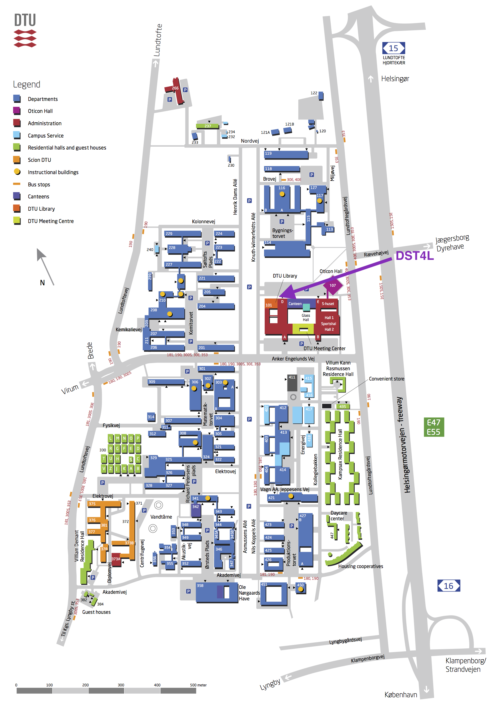

# DST4L - Practical information

This guide will provide you with information about how to get to DST4L in Copenhagen from 7th to 9th of December 2016.

* How to get around in general
* How to get to Copenhagen from the Airport
* How to get to the Technical University of Denmark (DTU).
* Accommodation
* Programme

## How to get around in general

There are two ways to transport yourself around in Copenhagen. By public transport or by bicycle.

* Travel planners
  * The official one is called [http://www.rejseplanen.dk/](http://www.rejseplanen.dk)
  * But Copenhagen is also pretty good covered by Google Maps.

* Public transport in Copenhagen consists of

    * Metro - two lines M1 and M2
      * most important is line M2 which connects to the airport
      * The metro operates 24/7
      * Btw. if you see a construction site in the city of Copenhagen it is probably related to the undergoing expansion of the Metro in Copenhagen.

    * S-tog (City train)
      * S-tog connects most of the major Copenhagen with train lines
      * Most important line is Line A and E that connects the Central Station (Hovedbanegården) and Nørreport with Lyngby (where DTU is located)

    * Busses
      * Copenhagen is connected with a vast network of Busses
      * Most important bus lines are 150S and 173E that brings you from the main hub Nørreport to DTU.

* Information about tickets and prices for public transportation
    * You can buy tickets on busses (cash) and in machines at the stations (cash/credit card)
    * But you may save money by checking out one of the many options available here:
      [http://www.visitcopenhagen.com/copenhagen/transportation/tickets-prices](http://www.visitcopenhagen.com/copenhagen/transportation/tickets-prices)

* Bicycles – if you want to transport yourself like the Danes you should travel by bicycle.
    * Many locals go the 15 km from Copenhagen to DTU every day.
    * Here’s a list of Bike rentals: [http://www.visitcopenhagen.com/search/editorial/global?keys=copenhagen%20copenhagen%20bike%20rentals](http://www.visitcopenhagen.com/search/editorial/global?keys=copenhagen%20copenhagen%20bike%20rentals)

## How to get to Copenhagen from the Airport

Copenhagen airport is well connected with bus, train and metro lines going to the city.
On the Copenhagen Airport web site you find more information: [http://www.cph.dk/en/parking-transport/bus-train-metro/](http://www.cph.dk/en/parking-transport/bus-train-metro/)
If you are going straight to DTU from the Airport catch the M2 to Nørreport and catch 150S or 173E from there to Rævehøjvej/DTU. Check the details here: [http://www.dtu.dk/english/About/Practical-information/Directions/DTU-Lyngby-Campus/public-transportation](http://www.dtu.dk/english/About/Practical-information/Directions/DTU-Lyngby-Campus/public-transportation) . It takes approx. 54 minutes.

## How to get to the Technical University of Denmark (DTU) and DTU Library

DST4L is located in the main library building at DTU. [See the map for location](http://www.dtu.dk/-/media/DTUdk/Om_DTU/Praktisk%20information/Kort%20over%20DTU/lyngby_kort_dk.ashx)
To get to DTU catch the 150S or 173E from there to Rævehøj/DTU and follow the crowd on foot towards DTU.
Read  more details here: [http://www.dtu.dk/english/About/Practical-information/Directions/DTU-Lyngby-Campus](http://www.dtu.dk/english/About/Practical-information/Directions/DTU-Lyngby-Campus)

[{:width="600px"}](img/lyngby_kort_uk.png)

[Full size](img/lyngby_kort_uk.png)

## Accomodation

The Technical University of Denmark is situated just 15 km North of the city of Copenhagen.
Most people will prefer to stay in the city and travel to DTU Campus in Lyngby everyday and stay in the city in the evenings.
Hotels in Copenhagen can be found using Booking.com, Hotels.com, Momondo.com and similar services.
Cheap options are available at one of the recommended Hostels in the city like [http://www.copenhagendowntown.com/rooms](http://www.copenhagendowntown.com/rooms) more info hostels here [http://www.visitcopenhagen.dk/da/kobenhavn/transport/hostels](http://www.visitcopenhagen.dk/da/kobenhavn/transport/hostels)

If you still prefer to stay in Lyngby – your best alternative is Bed and Breakfast like [Airbnb](https://www.airbnb.dk/s/DTU--Kongens-Lyngby--Danmark?ss_id=yoipe4ft)

## Programme
The always up-to-date programme can be found here: [http://www.dst4l.info/schedule/](http://www.dst4l.info/schedule/)
Most importantly to know is that we start everyday at 9.00 am sharp and that DST4L ends on the 9th of December at 16.00.
